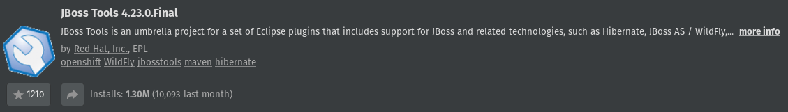
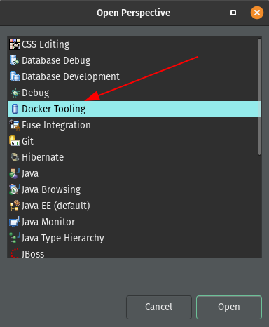
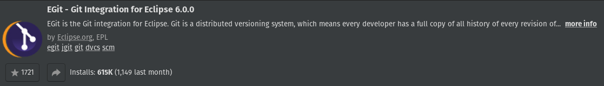
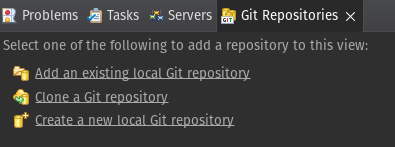
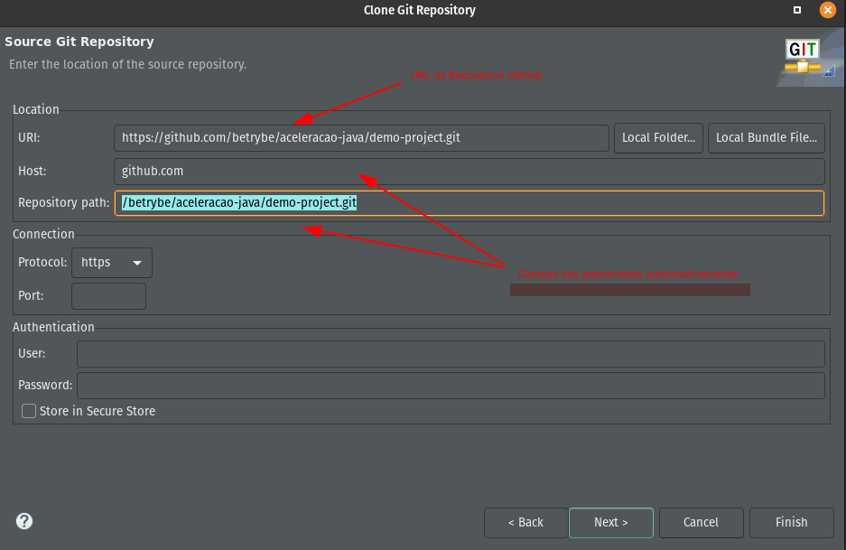

Instale o Eclipse atraves do [script](https://github.com/Vincenzofdg/Programms/blob/master/Eclipse.sh).

## Instalando as Ferramentas

### Docker
1. **Com o Eclipse aberto:** Help => Eclipse Maketplace;
2. Busque pelo plugin JBoss Tools;

3. Open Perstective;

4. Select `Docker Tooling`;
5. 

### Git
1. Com o Eclipse aberto: Help => Eclipse Maketplace;
2. Busque pelo plugin EGit;

3. **Clonando um repositorio:** Window => Show View => Other => Git Repository
4. Acesse a opção de clonar o repositorio;

5. Cloque a URL do Repositorio GitHub;

   - Campo de autenticação so será nescessário caso o repositório não seja publico 