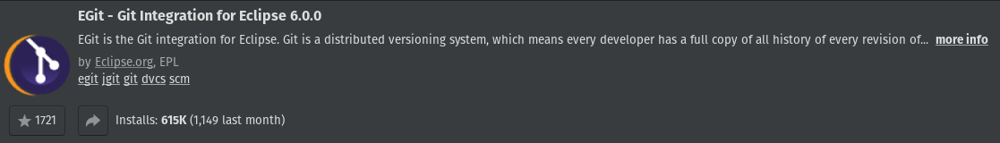
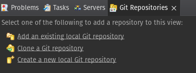
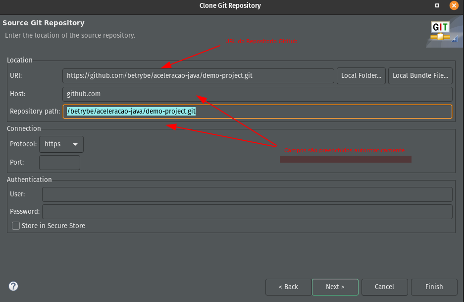

1. Com o Eclipse aberto: Help => Eclipse Maketplace;
2. Busque pelo plugin EGit;

3. **Clonando um repositorio:** Window => Show View => Other => Git Repository
4. Acesse a opção de clonar o repositorio;

5. Cloque a URL do Repositorio GitHub;

   - Campo de autenticação so será nescessário caso o repositório não seja publico 